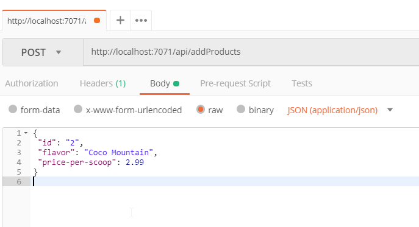
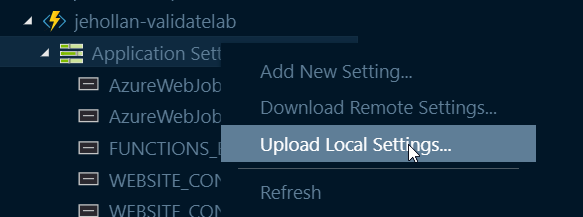

# Module 2 - Adding CosmosDB data

For this module we will take the function we created in module 1 and add some real data behind it.  This will enable us to query and update the ice cream flavor inventory as needed, and downstream applications and systems can use CosmosDB as the source of truth.

## Pre-requisites

* You must have the app working from module 1.  Feel free to use the answers folder if you want to jump ahead and open that solution in VS Code.
* For easy debugging I recommend installing the Azure CosmosDB Visual Studio Code extension or the Azure Storage Explorer
* You'll also need to make an HTTP POST, so I suggest getting an HTTP tester like [Postman](https://www.getpostman.com/apps)

## Challenge

Have two API endpoints, both backed by CosmosDB data.  When I call

```
GET http://{myFunctionEndpoint}/api/products?id=1
```

It would return:

```json
{
  "id": "1",
  "flavor": "Rainbow Road",
  "price-per-scoop": 3.99
}
```

However this data should be pulling from CosmosDB and could be updated at any time by updating CosmosDB directly.

In addition a new operation should be added to add products:

```
POST http://{myFunctionEndpoint}/api/addProducts
```

```json
{
 "id": "2",
 "flavor": "Coco Mountain",
 "price-per-scoop": 2.99
}
```

Which would add a new document to CosmosDB with the corresponding product information.

### Tips

1. First things first, go create a CosmosDB database in the cloud.
1. Check out the "Azure Functions CosmosDB binding" documentation and see what a sample of an input binding looks like.  You should be able to add an input binding.
1. If you want to use the query parameter value in an input binding use the syntax {Query.id} - so something like `"id": "{Query.id}"`
1. You'll need to create a second function app in the project in VS code with the name `addProducts`.  It will also be HTTP triggered but have a CosmosDB *output* binding.
1. Check out the [documentation](#documentation) for more guidance

### Guided instructions

<details><summary>Click to open</summary><p>

1. Open the Azure Portal and create a new Azure CosmosDB database.  **BE SURE TO SELECT SQL FOR THE API and Don't enable Virtual Networks**.
    * It's not required but I recommend putting this in the same resource group as the function app from module 1.
1. After the CosmosDB account has been created, open it and copy the "Primary Connection String" from the **Keys** section.  Save this for later.  You may even want to continue on with the next step and come back later to get the key as CosmosDB can take a few minutes to deploy.

    Now onto Visual Studio

1. Open your project in Visual Studio from Module 1.
1. Install `Microsoft.Azure.WebJobs.Extensions.CosmosDB` Nuget package.
1. Make the following code changes to the app to no longer expect static data, but to expect dynamic data returned from the CosmosDB *binding* in Azure Functions.

    ```cs
    public static class Products
    {
        [FunctionName("Products")]
        public static async Task<IActionResult> Run(
            [HttpTrigger(AuthorizationLevel.Anonymous, "get", "post", Route = null)] HttpRequest req,
            [CosmosDB(
                databaseName: "icecream",
                collectionName: "products",
                ConnectionStringSetting = "CosmosDBConnectionString",
                Id = "{Query.id}")] object product,
            ILogger log)
        {
            if (product != null)
            {
                return new OkObjectResult(product);
            }
            else
            {
                return new BadRequestObjectResult("Please pass in an id query parameter");
            }
        }
    }
    ```

    You'll notice that a few changes were made.  We're no longer passing back a static response, but instead returning a `product`.  That product was added to the method signature as well.  Now we need to configure what `product` should be.  That change is made in the `function.json` file in the same directory.


1. Please check function parameters.
    ```cs
    [CosmosDB(databaseName: "icecream", ConnectionStringSetting = "CosmosDBConnectionString", Id = "{Query.id}")]   
    ```  

    This attribute is adding a new binding in the function metadata for `CosmosDB`.  You'll see the name of the property we are setting `product`, which corresponds to the function code `product` in the previous step.  In addition we define information on which database and CosmosDB account to connect to.  Specifically we want to connect to the `icecream` database, `products` collection, with the CosmosDB account information from the `CosmosDBConnectionString` setting.  We'll get into that setting later.

    The last chage is the most interesting. You'll see we have an `Id` in the attribute. This is letting the *input* binding know which document ID to grab.  Azure Functions could also have a SQL query here to query multiple documents, but here we know the ID will be the query parameter `ID`.  Azure Functions provides syntax to grab properties from query or body parameters of triggers. In this case, `{Query.id}` is saying "Get the CosmosDB document in this collection that has the same ID as the `id` query parameter for the HTTP request".  So really the Azure Functions binding framework is doing all of the heavy lifting of exposing CosmosDB through an API.

    We won't be able to test this function yet, as the CosmosDB account created earlier is totally empty.  So let's add a new function.

1. In the Visual Studio, add a new function to this app.
1. Name it `AddProducts` and give it `anonymous` access permissions.
1. Replace the code in the new function for with the following:

    ```cs
    public static class AddProducts
    {
        [FunctionName("AddProducts")]
        public static async Task<IActionResult> Run(
            [HttpTrigger(AuthorizationLevel.Anonymous, "post", Route = null)] HttpRequest req,
            [CosmosDB(
                databaseName: "icecream",
                collectionName: "products",
                CreateIfNotExists = true,
                ConnectionStringSetting = "CosmosDbConnectionString")] IAsyncCollector<dynamic> products,
            ILogger log)
        {
            var requestBody = await new StreamReader(req.Body).ReadToEndAsync();
            dynamic product = JsonConvert.DeserializeObject(requestBody);
            await products.AddAsync(product);

            return new OkResult();
        }
    }
    ```

    You'll notice we don't need a lot of code here.  In this case we have the same inputs as a regular HTTP function, but in the `context` we are setting the value of a binding `product` to the request body of the HTTP request.  That single line of code is all we need to add a document to CosmosDB!  However we do need to define the metadata so the function runtime knows where to put that document.

1. Open the `local.settings.json` file at the root of the project.  It should look like this:

    ```json
    {
      "IsEncrypted": false,
      "Values": {
        "AzureWebJobsStorage": "",
        "FUNCTIONS_WORKER_RUNTIME": "dotnet"
      }
    }
    ```

    To get our functions running we need to do two things.  First we need to add a connection string for `AzureWebJobsStorage`.  This is a storage account the function will use for state and to integrate with some triggers and bindings like CosmosDB.  The seccond is we need to add a new settings `CosmosDbConnectionString`.  This is the setting that will give our previous functions access to the cosmosDB account we created.

1. Open the Azure Portal to the resource group with your published function app from step 1.  You should see a Storage Account in that resource group (green square icon).  Open it, select **Access Keys** in the left-hand nav, and copy the **Connection string** for **key1**.  Paste this value in the quotes for `AzureWebJobsStorage` in the `local.settings.json` file.
1. Add a new `Values` for `CosmosDbConnectionString` in the `local.settings.json` file and paste in the connection string from the CosmosDB account created in the earlier steps.
1. Your `local.settings.json` should now look something like this:
    
    ```json
    {
        "IsEncrypted": false,
        "Values": {
          "CosmosDbConnectionString": "AccountEndpoint=https://awesome-function-lab.documents.azure.com:443/;AccountKey=Thisisasecret;",
          "FUNCTIONS_WORKER_RUNTIME": "dotnet"
        }
      }
      
    ```

1. Click the **Debug** menu and **Start Debugging**.
    > The first time you debug a function that has a binding or trigger other than HTTP / timer, the local runtime will install the extension.  The latest version of VS Code should do this automatically for you.  However if not you may need to run the command `func extensions install` at the root of the project.

    You should see two URLs generated like the following:

    > Http Functions:
    > addProducts: http://localhost:7071/api/addProducts
    > products: http://localhost:7071/api/products

1. Open Postman to create a document.  
    1. Create a `POST` request to `http://localhost:7071/api/addProducts`
    1. Select **Body**, choose **raw** and toggle the type to **JSON (application/json)**
    1. Add the following product:

    ```json
    {
         "id": "2",
         "flavor": "Coco Mountain",
         "price-per-scoop": 2.99
    }
    ```  

      

1. Send the request, you should get a 200 response back.  If you go now to the CosmosDB Visual Studio extension or the CosmosDB account in the Azure Portal and opening the Data explorer, you should see this added into the CosmosDB account (icecream database, products collection).
1. Make another request but add in a second flavor
    ```json
    {
         "id": "1",
         "flavor": "Rainbow Road",
         "price-per-scoop": 3.99
    }
    ```

    Our CosmosDB backend should have both files.

1. Using Postman (or a web browser), query both of these documents
    1. Make a `GET` request to `http://localhost:7071/api/products?id=2` and `http://localhost:7071/api/products?id=1`
    1. You should see the docs returned from CosmosDB (as well as some additional properties CosmosDB has added)
    
    ```json
    {
        "id": "2",
        "_rid": "Z7l8ALN6PzQBAAAAAAAAAA==",
        "_self": "dbs/Z7l8AA==/colls/Z7l8ALN6PzQ=/docs/Z7l8ALN6PzQBAAAAAAAAAA==/",
        "_ts": 1536957687,
        "_etag": "\"6200bebd-0000-0000-0000-5b9c1cf70000\"",
        "flavor": "Coco Mountain",
        "price-per-scoop": 2.99
    }
    ```

    Now that the app is working and backed by CosmosDB, we need to publish this update.

1. Open the Azure Functions in Visual Studio and click the up-arrow icon to publish
1. Choose the current folder, and select the function app created in step 1
    1. You should see a notification that the app is updating
1. There is one last step.  We need to update the application settings in your published app to have the changes we made to local settings.  In the VS Code Azure Functions extension, find your function app, open it, right-click the "Application Settings" and choose **Upload local settings..**.  This will push your local settings up to your published app.

    

1. Open your function in the Azure Portal, get the URLs, and verify the functions work in your published apps

</p></details>

## Documentation

* [Azure Cosmos DB Overview](https://docs.microsoft.com/en-us/azure/cosmos-db/introduction)
* [Azure Functions CosmosDB Binding (v2)](https://docs.microsoft.com/en-us/azure/azure-functions/functions-bindings-cosmosdb-v2)
* [Azure CosmosDB Visual Studio Code extension](https://marketplace.visualstudio.com/items?itemName=ms-azuretools.vscode-cosmosdb)