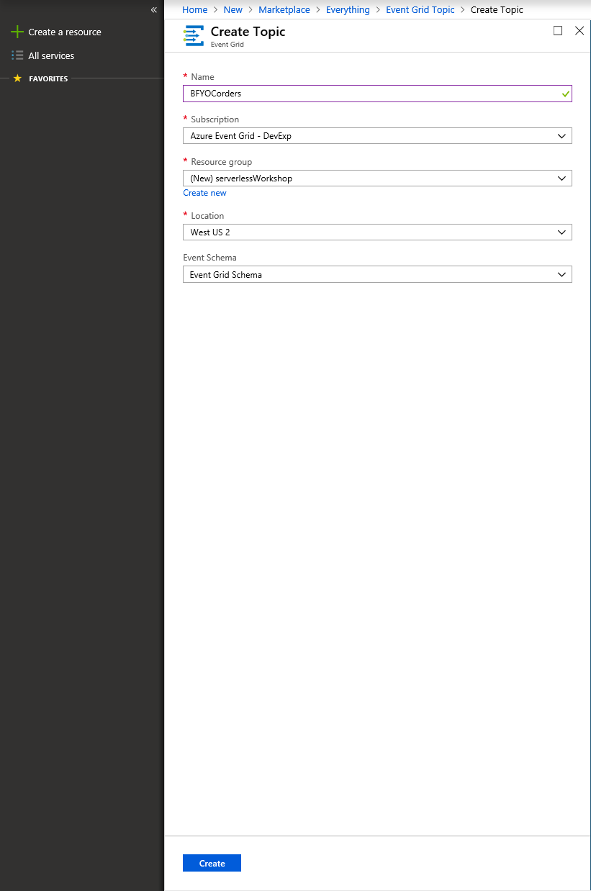
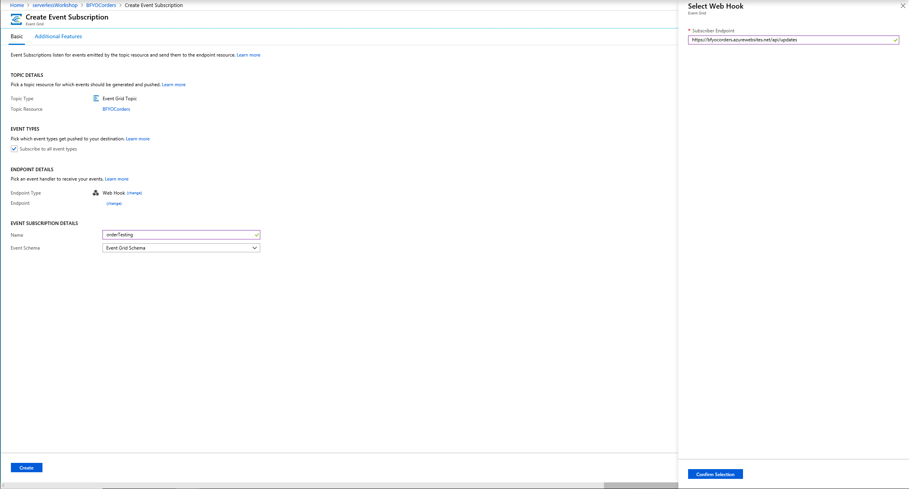

# Module 3 - Making BFYOC event driven

BFYOC is also making its marketing efforts event driven. You will also be creating a system that will publish your own custom event every time an order is placed. You'll be able to use this system in the next module to trigger downstream apps and workflows.

This module will walk you though subscribing to Azure events as well as publishing custom events in order to build event based reactive programs using Azure Event Grid.

## Challenge

Create an Azure Function that [publishes an event to a custom topic](https://docs.microsoft.com/en-us/azure/event-grid/post-to-custom-topic) with data about the Ice Cream order every time it is triggered.

The event posted to the custom topic must be of the form:

```json
[
  {
    "id": string,
    "eventType": "BFYOC.IceCream.Order",
    "subject": string,
    "eventTime": string-in-date-time-format,
    "data":{
        "orderId": string,
        "itemOrdered": string,
        "email": string
    },
    "dataVersion": string
  }
]
```

The data payload is the order data, and the outer envelope is the event metadata.

You may input your order and trigger the Function however you choose, however, we recommend a POST to an HTTP triggered Function as in the first two modules for simplicity:

```
POST http://{myFunctionEndpoint}/api/iceCreamOrder
```

```json
{
  "orderId": "1",
  "itemOrdered": "52325",
  "email": "hello@contoso.com"
}
``` 

### Tips

1. You will need to start by [creating a custom topic](https://docs.microsoft.com/en-us/azure/event-grid/scripts/event-grid-cli-create-custom-topic) to push your custom events to. This can be done via the portal, CLI, or PowerShell.
1. You will need to follow the same process as in modules one and two in order to create an HTTP triggered function.
1. Once you have your function posting to your custom topic, you can test it out by [subscribing to your topic](https://docs.microsoft.com/en-us/azure/event-grid/scripts/event-grid-cli-subscribe-custom-topic) via the Portal, CLI, or Powershell and sending the events to the same web app that you made in part one of this module.

### Guided instructions

<details><summary>Click to open</summary><p>

1. Open the Azure Portal and create an Event Grid Topic.
  
  * Note your Topic endpoint and key, you will need these later.

  We are creating the Topic as a place to send an event every time an order is placed for ice cream. This will allow us subscribe to events regarding ice cream orders and decouple any future downstream processes. Our marketing, operations, and management teams could all subscribe to this topic and listen to events relevant to them without modifying this module.

1. Open your project in VS Code from the previous two modules.

  We need a new function that will handle incoming orders and create an event every time an order is made. Let's go ahead and create that.

1. In the Visual Studio Code extension for Azure Functions, click the lightning bolt icon to add a new function to this app.
1. Select the current folder and add to the existing app. This function will also be HTTP triggered.
1. Name it `iceCreamOrder` and give it `anonymous` access permissions.
1. Replace the code in the new `index.js` for `iceCreamOrder` with the following:

  ```javascript
  var uuid = require('uuid').v4;
  var msRestAzure = require('ms-rest-azure');
  var eventGrid = require("azure-eventgrid");
  var url = require('url');

  module.exports = function (context, req) {
      context.log('New ice cream order made.');

      if (req.body) {
          // TODO: Enter value for topicKey
          let topicKey = '<aeg-sas-key>';
          // TODO: Enter value for topic-endpoint
          let topicEndPoint = '<topic-endpoint>';

          let topicCreds = new msRestAzure.TopicCredentials(topicKey);
          let egClient = new eventGrid(topicCreds);
          let topicUrl = url.parse(topicEndPoint, true);
          let topicHostName = topicUrl.host;
          let currentDate = new Date();

          let events = [
              {
                  id: uuid(),
                  subject: 'BFYOC/stores/serverlessWorkshop/orders',
                  dataVersion: '2.0',
                  eventType: 'BFYOC.IceCream.Order',
                  data: req.body,
                  eventTime: currentDate
              }
          ];
          egClient.publishEvents(topicHostName, events).then((result) => {
              return Promise.resolve(console.log('Published events successfully.'));
          }).catch((err) => {
              console.log('An error ocurred ' + err);
          });
      }
      else {
          context.res = {
              status: 400,
              body: "Please pass an ice cream order in the request body"
          };
      }
      context.done();
  };
  ```

  Make sure you update the `<topic-endpoint>` and `<aeg-sas-key>` with that of your topic from the first step.

  What we are doing here is taking the body of the HTTP request and making it the data payload of an Event Grid event. Then all we have to do is add our SAS key as a header value and make an HTTP POST to the topic endpoint with our event as the message body.

1. Update the contents of the `function.json` file in the `IceCreamOrder` folder to the following by deleting the GET method from the input binding:

    ```json
    {
      "disabled": false,
      "bindings": [
        {
          "authLevel": "anonymous",
          "type": "httpTrigger",
          "direction": "in",
          "name": "req",
          "methods": [
            "post"
          ]
        },
        {
          "type": "http",
          "direction": "out",
          "name": "res"
        }
      ]
    }
    ```

  We are telling our function it should expect an HTTP POST to trigger it not a GET. We don't want the function to be triggered erroneously.

  Now lets test everything to see it running and makes sure it works.

1. If you have not already created an Event Grid Viewer web app, deploy one now by clicking the button below.

    <a href="https://portal.azure.com/#create/Microsoft.Template/uri/https%3A%2F%2Fraw.githubusercontent.com%2FAzure-Samples%2Fazure-event-grid-viewer%2Fmaster%2Fazuredeploy.json" target="_blank"></a>

1. Navigate to your website at `https://<your-site-name>.azurewebsites.net`.

  

1. Now, to see your orders flowing in real time, open the Azure Portal and navigate to your ice cream order Topic. Create an new event subscription on the topic and set the endpoint to `https://<your-site-name>.azurewebsites.net/api/updates`.

  * You will see a Subscription Validation Event appear in your viewer - this is part of [Event Grid's security model](https://docs.microsoft.com/en-us/azure/event-grid/security-authentication), however in this case the viewer handles things for you, so nothing further is required by you.

  

1. Click the **Debug** menu and **Start Debugging**.

    You should see a new URL in addition to the previous APIs you've created:

    > Http Functions:
    > iceCreamOrder: http://localhost:7071/api/iceCreamOrder

1. Open Postman to create a document.  
    1. Create a `POST` request to `http://localhost:7071/api/iceCreamOrder`
    1. Select **Body**, choose **raw** and toggle the type to **JSON (application/json)**
    1. Add the following order:

    ```json
    {
      "orderId": "1",
      "itemOrdered": "52325",
      "email": "hello@contoso.com"
    }
    ```  

    This should be familiar from previous sections.

1. Send the request, you should get a 200 response back. If you go to your Event Viewer web app `https://<your-site-name>.azurewebsites.net`, you should now see a new event for the order you just placed.
1. Try sending some more orders:
    ```json
    {
      "orderId": "2",
      "itemOrdered": "88295",
      "email": "hello@contoso.com"
    }
    ```

1. Now that you have your Topic setup and working, you can create as many Event Subscription on it as you need to trigger downstream applications and workflows in real-time.

  Let's publish this new functionality.

1. Open the Azure Functions extension in VS Code and click the up-arrow icon to publish
1. Choose the current folder, and select the function app created in step 1
    1. You should see a notification that the app is updating
1. Open your function in the Azure Portal, get the URLs, and verify the functions work in your published apps

</p></details>

## Bonus

BFYOC ice cream is always updating their ice cream offerings and you need to keep your franchise's ice cream availability constantly up to date. Each time BFYOC adds a new flavor, you'll need to update your CosmodDB from module two with the new offering. BFYOC now has a staff writer and a photographer, so each ice cream will be made available to you with the product data, description, and photo as separate files.

### Pre-requisites

* You must have your app backed by CosmosDB from module two. If you are stuck there or want to jump ahead, you can always use the answers folder in the previous modules.

### Bonus Challenge

So far, you should have implemented a simple API to add products to CosmosDB using just a POST, however now that we have a staff writer and photographer, we don't want to add a product until the data, photo, and description are all available.

Create a storage account of kind `storagev2 (general purpose v2)` or `blob` where your staff writer, photographer, and inventory manager will upload the files to blob storage. Once *all three* files are uploaded for a given ice cream, add a new document to CosmosDB with the aggregated information from all three files:

```json
{
    "id": "081517EG",
    "flavor": "Wonder Blast",
    "price-per-scoop": 0.60,
    "photo-url": "https://example.blob.core.windows.net/examplecontainer/081517EG-photo.png",
    "description": " Topping biscuit cookie chocolate bar lemon drops oat cake gummies jelly. Chocolate cake donut chocolate cupcake. Wafer gingerbread croissant liquorice tootsie roll. Cake lemon drops jujubes jujubes chocolate jelly beans marzipan fruitcake oat cake. Sweet roll tiramisu topping. Cheesecake tootsie roll icing fruitcake sesame snaps bonbon jelly-o biscuit."
}
```

To correlate the files, each will be prefixed with the product ID.

* Product data: JSON containing the product ID, flavor, and price as in the previous modules `081517EG-data.json`
* Product description: Text file containing a few sentences describing the flavor `081517EG-description.txt`
* Product photo: Photo of the product `081517EG-photo.png`

Two sets of sample files have been provided for you in the supporting-files folder of this module.

### Tips

1. Using Event Grid will allow you to subscribe to `Microsoft.Storage.BlobCreated` events and have then pushed anywhere in real time. [Here is a quickstart](https://docs.microsoft.com/en-us/azure/event-grid/blob-event-quickstart-portal).
1. You can deploy a pre-built web app by clicking the button below to send your events to and see them flowing in real time. Super handy for testing.

    <a href="https://portal.azure.com/#create/Microsoft.Template/uri/https%3A%2F%2Fraw.githubusercontent.com%2FAzure-Samples%2Fazure-event-grid-viewer%2Fmaster%2Fazuredeploy.json" target="_blank"></a>

    * Connect Event Subscriptions to the website by setting the Subscription's Endpoint to `https://<your-site-name>.azurewebsites.net/api/updates`.
    * View your website by navigating to `https://<your-site-name>.azurewebsites.net`.

    
1. You can choose to use [Durable Functions](https://docs.microsoft.com/en-us/azure/azure-functions/durable-functions-overview) to create stateful functions in a serverless environment. This is one way of solving the problem of waiting for all three files to be available before creating your new document in CosmosDB.

1. Like all of the modules in this workshop, there are many ways of accomplishing this objective:

 * Durable functions with a suborchestrator intrance for each batch that waits for all three files.
 * Using a regular function and with each new file upload, check if all three of the batch are present.
 * Using the Logic Apps batch trigger.
 * Loading all files into Cosmos and then a second process that check for all three files of a given batch on some regular interval.
 * Many more...


## Documentation

* [An overview of Azure Event Grid](https://docs.microsoft.com/en-us/azure/event-grid/overview)
* [Blob Storage quickstart](https://docs.microsoft.com/en-us/azure/event-grid/blob-event-quickstart-portal)
* [Custom Events quickstart](https://docs.microsoft.com/en-us/azure/event-grid/custom-event-quickstart-portal)
* [How to receive events from Event Grid](https://docs.microsoft.com/en-us/azure/event-grid/receive-events)
* [Available tutorials, quickstarts, and docs on Event Sources](https://docs.microsoft.com/en-us/azure/event-grid/event-sources)
* [Available tutorials, quickstarts, and docs on Event Handlers](https://docs.microsoft.com/en-us/azure/event-grid/event-handlers)