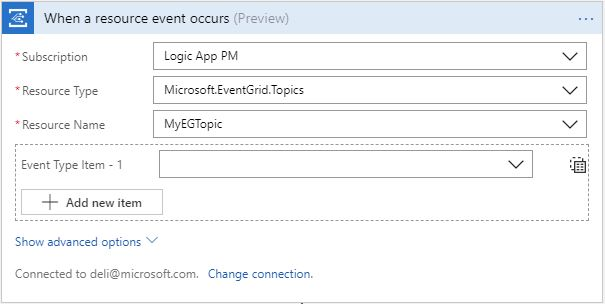
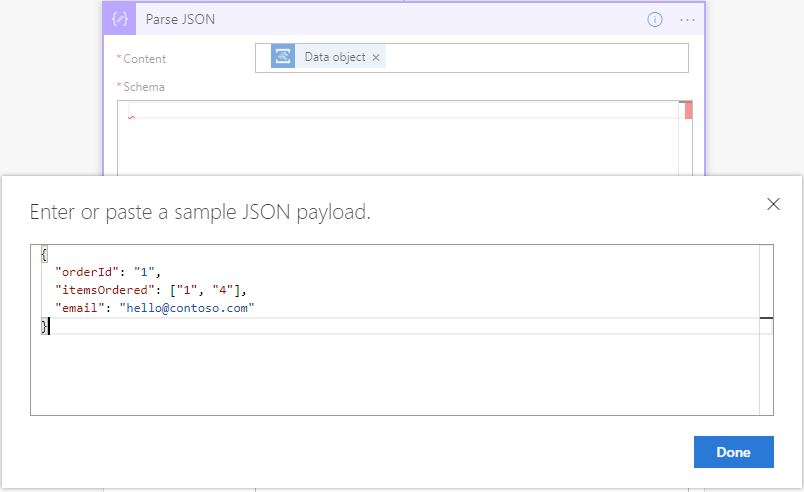
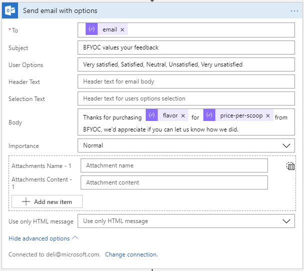
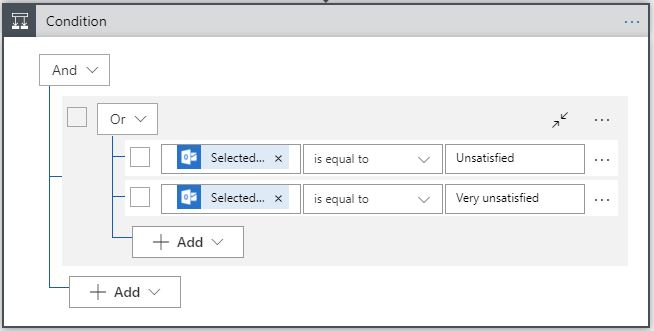

# Module 4 - Logic Apps

As BFYOC, customer satisfaction is of the utmost importance. Because of this, BFYOC has decided to implement a customer survey system to follow up after purchase to collect feedback.

In this module, you will be using Logic Apps as the workflow engine and integration platform to connect all the pieces together and implement such system. Let's get started.

## Pre-requisites

* A modern laptop running Windows 10, Mac OSX Mac OS X 10.12 or higher
* Your preferred browser to access [Azure Portal](https://portal.azure.com)
* An Outlook 365 or Outlook.com e-mail account
* Completetion of Module 1, 2, and 3

## Challenge

Create a Logic App that will be triggered by a purchase event from the custom Event Grid topic you created in Module 3. 

```json
{
  "orderId": "1",
  "itemOrdered": "52325",
  "email": "hello@contoso.com"
}
```

Upon receiving the event, the Logic App will query Cosmos DB to retrieve the product information from `itemOrdered` property. Then, send an e-mail with different options (`Very satisfied`, `Satisfied`, `Neutral`, `Unsatisfied`, `Very unsatisfied`) so users can response. Finally, record customer's response in Cosmos DB and take appropriate actions.

### Tips

1. First things first, make sure your machine is all set up and can sign into [Azure Portal](https://portal.azure.com).
1. If you have neither Outlook 365 nor Outlook.com account, [sign up for a free Outlook.com account]().
1. If you did not complete Module 3, don't worry, instead of using event to trigger the Logic App, use a **Request** trigger instead.
1. You will also need another Cosmos DB collection to store customer's feedback, so make sure to create one within the same database you created in Module 2.

### Guided instructions
<!-- markdownlint-disable MD032 MD033 -->
<details><summary>Click to open</summary><p>
  
1. Navigate to [Azure Portal](https://portal.azure.com)
1. Create a new Logic App and navigate to the newly created Logic App
1. Edit on **Edit** to launch Logic App designer, select **Start from blank** on the template page
1. Select `Event Grid` from the list then select `When a resource event occurs` trigger

1. Sign in with the same account you used to sign into Azure portal
1. Fill in **Subscription**, select `Microsoft.EventGrid.Topics` for **Resource Type**, and select the name you of your custom topic created in **module 3**. You may ignore "Event Type Item" selection for this execrise.
1. Before proceed any further, let's make sure the trigger works. Save the Logic App, and invoke the purchse function you created in Module 3.
```
POST http://{myFunctionEndpoint}/api/iceCreamOrder
```
1. Close the designer and refresh the Logic App to load new runs, you should see one or more (depending on how many calls you made to the purchase function) funs.

1. Once confirmed, switch back to designer by clicking the **Edit** button, and add a `Parse JSON` action by clicking **New step** and search for it.
1. Use `Data object` as the input to  **Content**.
1. The easiest way to create the schema is to generate it using a sample, simply click on **Use sample payload to generate schema**, and provide the sample from **module 3**, as shown below.
```json
{
  "orderId": "1",
  "itemOrdered": "52325",
  "email": "hello@contoso.com"
}
```

1. Search for `Cosmos Db` and add `Get a document` action, you will first need to create a connection to it.
1. Select `icecream` as **Database ID**, `products` as **Collection ID**, and select `itemOrdered` token as input to **DocumentId**.
1. Next, add a new action from either Outlook 365 or Outlook.com, depending on the type of account you have. The name of the action is **Send email with options**.
1. Add another `Parse JSON` action, this time, use the `Body` output from `Get a document` action as input to **Content**, and use the following sample to generate schema.
```json
{
  "id": "1",
  "flavor": "Rainbow Road",
  "price-per-scoop": 3.99
}
```
1. Use `email` token as input for **To**, `BFYOC values your feedback` as **Subject**, and `Very satisfied, Satisfied, Neutral, Unsatisfied, Very unsatisfied` for **User Options**. Then, use various tokens available to write a nice e-mail body.

1. Once customer selected an option, it will be captured and send back to Logic App for it to continue it's execution. Let's store it in the Cosmos DB first.
1. Search and add **Cosmos - Create or update document** action.
1. Select `icecream` as **Database ID**, `reviews` as **Collection ID**, and the following JSON object as **Doument**.
```json
{
  "id": "[Use expression editor to insert guid() expression]",
  "review": "[Selected option token]"
}
```

### What's Next?
It's up to you what action to take when there's an unhappy customer! Send them a email with coupon code, inform a team member to follow up, you decided. Explore more than [200 different products and services](https://docs.microsoft.com/connectors/) Logic Apps connects to out-of-box and build something awesome.

For example, consider adding a `Condition` action, and create a rule for when customer selected either **Unsatisfied** or **Very unsatisfied**.
. In the **If true** branch, send an e-mail to BFYOC team to alert them when there's an unhappy customer.
 
</p></details>
<!-- markdownlint-disable MD032 MD033 -->

## Documentation

* [Quickstart: Create your first automated workflow with Azure Logic Apps - Azure portal](https://docs.microsoft.com/azure/logic-apps/quickstart-create-first-logic-app-workflow)
* [Manage mailing list requests with a logic app](https://docs.microsoft.com/azure/logic-apps/tutorial-process-mailing-list-subscriptions-workflow)
* [Get started with the delay and delay-until actions](https://docs.microsoft.com/azure/connectors/connectors-native-delay)