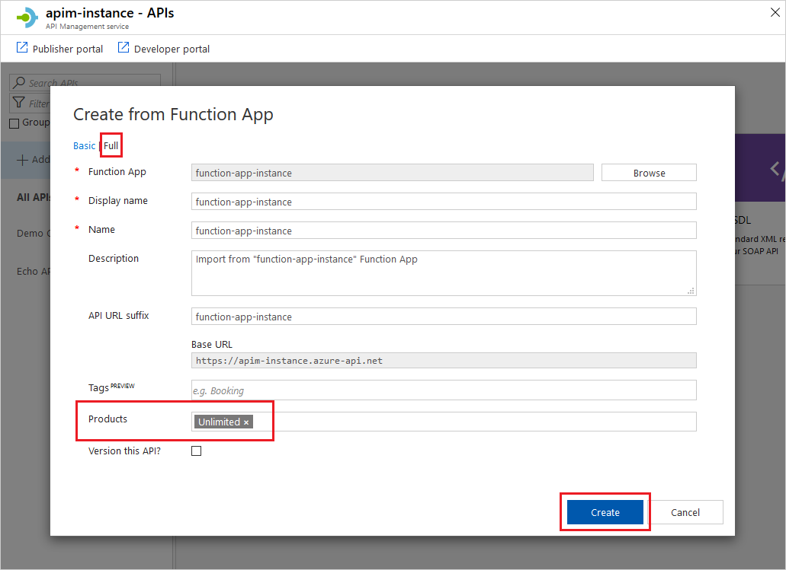

# Module 5 - Logic Apps

As BFYOC, security data access is as important as customer satisfaction. Because of this, BFYOC has decided to implement an API Management as a security layer between end-user/application and its API.

In this module, you will be using API Management as the security layer and expose the API in a secure way.

## Pre-requisites

* A modern laptop running Windows 10, Mac OSX Mac OS X 10.12 or higher
* Your preferred browser to access [Azure Portal](https://portal.azure.com)
* Completetion of Module 1 and 2

## Challenge

Create a serverless API Management which will integrate with your Function App and expose data to new customer, .

### Tips

TBD

### Guided instructions
<!-- markdownlint-disable MD032 MD033 -->

Click to open

  
1. Navigate to [Azure Portal](https://portal.azure.com)
1. Create a new API Management and navigate to the newly created API Management
1. In your API Management service instance, select **APIs** from the menu on the left.
1. In the **Add a new API** list, select **Function App**.
1. Click **Browse** to select Functions for import.
1. Click on the **Function App** section to choose your Function App created in Module 1.
1. Find the Function App you want to import Functions from, click on it and press **Select**.
1. Select all Functions to import and click **Select**.
    > [!NOTE]
    > You can import only Functions that are based off HTTP trigger and have the authorization level setting set to *Anonymous* or *Function*.
1. Switch to the **Full** view and assign **Product** to your new API. If needed, edit other pre-populated fields.

    

1. Click **Create**.

<!-- markdownlint-disable MD032 MD033 -->

## Documentation

* [Import an Azure Function App as an API in Azure API Management](https://docs.microsoft.com/bs-latn-ba/azure/api-management/import-function-app-as-api)